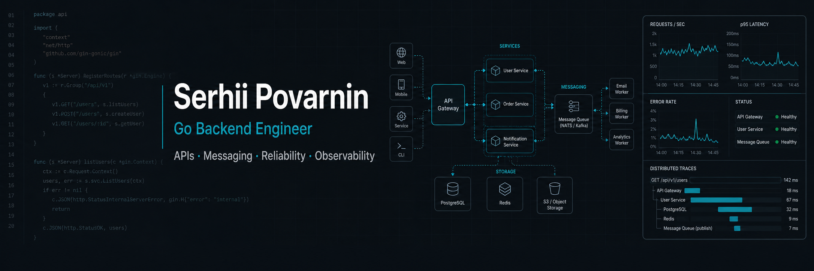

# Hi, I'm Serhii 👋

Senior Go Backend Engineer focused on backend services, APIs, messaging systems, reliability, performance, and observability.

I have production experience in telecom and high-load messaging systems: SMPP, SS7/SIGTRAN, Redis-based queues, MySQL, MongoDB, ClickHouse, Prometheus, Grafana and Loki.
Currently I am turning that experience into public Go portfolio projects and focused learning labs around Web/API development, microservices, profiling, queues, and observability.

---

## ⚙️ What I work on

* Building and improving Go backend services: HTTP APIs, gRPC services, background workers, integrations
* Designing service boundaries, modular monoliths, and service-oriented systems
* Improving reliability: graceful shutdown, timeouts, retries, idempotency, queue processing
* Profiling Go services with `pprof` and investigating CPU, memory, goroutines, locks, queues and latency
* Adding useful observability: metrics, structured logs, dashboards, health checks and operational notes
* Keeping backend projects readable, testable and maintainable, because future humans deserve mercy too

---

## 🛠 Core expertise

* **Backend:** Go, REST/HTTP APIs, gRPC, protobuf, routing, middleware, validation, service layers
* **Architecture:** modular monoliths, layered architecture, service-oriented architecture, service boundaries
* **Messaging & data:** Redis, MySQL, PostgreSQL, SQLite, MongoDB, ClickHouse, queues, message routing
* **Performance & reliability:** pprof, load testing, concurrency, bottleneck analysis, graceful shutdown, retries
* **Observability:** Prometheus, Grafana, Loki, structured logging, metrics
* **Infrastructure:** Linux, Docker, Docker Compose, Git, GitHub/GitLab, CI basics, Ansible
* **Telecom background:** SMPP, SS7/SIGTRAN, SCTP, HLR, MNP, SMS routing

Currently practicing: Kubernetes basics, NATS/JetStream, OpenAPI, CI/CD, OpenTelemetry, HTMX and server-side rendering.

---

## 🎯 Current focus

### Go Web / Backend APIs

I am building practical Go Web/API skills around:

* `net/http`, Chi, routing and middleware
* REST APIs, validation, errors and API contracts
* SQL-backed applications with migrations, tests and authentication
* server-side rendering, OpenAPI and handoff documentation

### Go Microservices / Messaging

I am practicing microservice fundamentals with:

* gRPC and protobuf contracts
* NATS/JetStream and event-driven architecture
* service boundaries, communication patterns and Docker-based local development
* background workers, retries, idempotency and DLQ ideas

### Performance / Observability

I am turning production experience into public practice projects around:

* Redis queues and message-processing pipelines
* profiling with `pprof`: goroutines, memory, CPU and lock/contention analysis
* Prometheus/Grafana dashboards
* reliability and operational checklists

---

## 🚀 Projects

### [book-social](https://github.com/LeeDark/book-social)

Go-based book social platform prototype and primary applied portfolio project.

Focus:

* modular monolith architecture
* layered HTTP services
* server-side rendering
* SQL-backed domain model
* catalog, books, authors, genres and user-facing pages
* Docker/Compose and basic deployment practice
* tests, documentation and gradual API evolution

This is where patterns from my Go Web labs become a real application.

---

### [go-web-labs](https://github.com/LeeDark/go-web-labs)

Learning and reference repository for practical Go web development.

Focus:

* Go web fundamentals
* REST API patterns
* routing, middleware and handlers
* SQL, migrations and storage patterns
* testing basics
* API security notes
* OpenAPI and documentation
* reusable patterns for `book-social`

---

### [go-microservices-starter](https://github.com/LeeDark/go-microservices-starter)

Go microservices learning repository based on a course-style buildout, used to practice service communication, protobuf contracts and deployment basics.

Focus:

* REST and gRPC service examples
* protobuf contracts
* Docker-based local setup
* microservice communication patterns
* observability and reliability fundamentals

---

### Planned / in progress

In progress:

* `go-profiling-lab` — Go profiling scenarios with pprof, goroutines, locks, memory and latency

Planned:

* `redis-queue-lab` — Redis queues, retries, idempotency, backpressure, DLQ and metrics
* `go-service-starter` — small Go backend service skeleton with API, DB, tests, Docker and observability basics
* `go-perf-audit-sandbox` — performance audit playground for profiling and bottleneck analysis

---

## 💼 Freelance focus

I am shaping my public portfolio around two practical offers:

1. **Go Backend APIs & Integrations**
   Small backend fixes, REST/gRPC endpoints, database-backed features, integrations, tests and handoff notes.

2. **Go Performance, Profiling & Observability**
   Profiling, bottleneck analysis, queue/reliability improvements, metrics, dashboards and practical reliability fixes.

---

## 🧭 Earlier background

Before focusing on Go backend systems, I worked with C++, Java/JAIN SLEE, Python/OpenCV/TensorFlow, Solidity/Web3 and system-level/backend projects.

That background still helps: I am comfortable reading legacy systems, understanding protocols, and debugging complex runtime behavior.

---

## 📬 Contact

* Email: [sergey.povarnin@gmail.com](mailto:sergey.povarnin@gmail.com)
* LinkedIn: [linkedin.com/in/serhii-povarnin](https://www.linkedin.com/in/serhii-povarnin/)
* GitHub: [github.com/LeeDark](https://github.com/LeeDark)
* Telegram: @thom_york_ua
